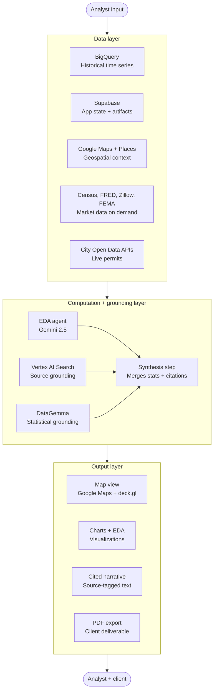

# Scout

A geospatial data engine, bounded EDA assistant, and automated reporting platform for real estate analytics. Scout unifies public market signals with proprietary analyst datasets so users can inspect loaded data quickly, control the map directly when needed, and generate briefs without relying on open-ended autonomous agent behavior.

## Core Features

* **Unified Pipeline:** Ingests and normalizes data from 8 public sources, including Zillow, Census ACS, FRED, HUD, Transitland, and NYC Open Data.
* **CSV Import + Normalization:** Drag-and-drop CSV uploads are automatically categorized, classified for mapability, and routed to map, chart, or table views.
* **EDA Assistant:** The default AI surface summarizes loaded markets and uploaded datasets, explains metrics, flags outliers, and calls out data-quality issues using deterministic workspace evidence.
* **Saved Workspace:** Saved Sites persists map/site context, and Saved Outputs collects charts, retail comparison cards, uploaded site snapshots, and nearby-place context for the current browser session.
* **Spatial Engine:** Renders dense datasets, including parcels and building permits, smoothly via WebGL.
* **Automated Reporting:** Generates structured, exportable PDF market briefs directly from the live map state.

## Architecture

* **Frontend:** Next.js, React, Tailwind CSS
* **Spatial:** deck.gl, Google Maps Platform (Vector Mode)
* **Database:** Supabase (PostgreSQL, PostGIS)
* **Intelligence:** Gemini 2.5 Flash over deterministic EDA summaries and explicit map-control guards
* **Reporting:** @react-pdf/renderer

## Diagram

## Submission Notes

- **Public GitHub Repo:** https://github.com/Stunned1/Projectr-Analytics
- **Live Deployment:** https://projectr-analytics.vercel.app/
- **Generative AI Disclosure:** most shipped files started with AI-assisted drafts or scaffolds at some point, then went through human review, correction, retouching, and product-specific iteration before landing in the repo.
- **Planning Evidence:** the [`/dev`](./dev) folder contains the submission planning diagram, demo storyboard, system architecture plan, and agent workflow diagram that guided the build.
- **Open-Source Disclosure:** Scout builds on Next.js/React, deck.gl, `@vis.gl/react-google-maps`, Supabase, `@react-pdf/renderer`, Recharts, Zustand, and `google-trends-api`.

## How to Run Scout

### Recommended For Judges

Use the deployed Vercel app for the simplest review path and the fullest data coverage.

Live app: https://projectr-analytics.vercel.app/

### Local Development

1. `cd projectr-analytics`
2. `npm install`
3. `npm run dev`
4. Open `http://localhost:3000`

Local development is supported, but without the production-backed Supabase data, BigQuery access, Zillow ingests, and warmed caches, some historical, aggregate, permit, and reporting flows will be incomplete or empty.
